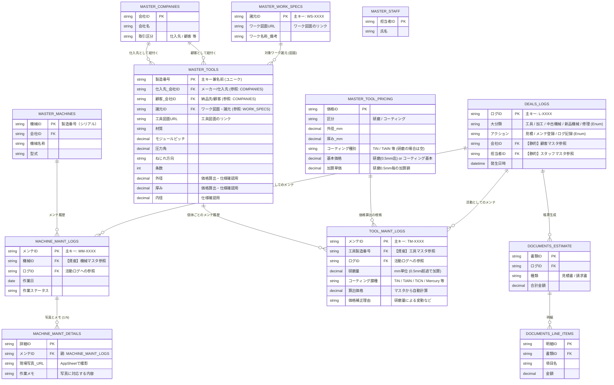

# 案件管理システム (メンテ特化・工具詳細型) - データベース設計図（ER図）

工具の「製造番号」を主キー（ユニークな名前）とし、詳細なスペック情報（諸元）とワーク図面、仕入先・顧客などを相互に紐づけた最新のデータベース設計図です。

## ER図（エンティティ・リレーションシップ図）

---

## 新設計のポイント（工具管理の高度化）

1.  **「製造番号」を主キー（一意の名前）へ変更**
    *   工具データベースの中心（ID）を `製造番号` とし、システム上で工具を指定する際は必ずこの製造番号を選択・参照するようにしました。
2.  **詳細な基本スペック（仕様）の網羅**
    *   材質、モジュールピッチ、圧力角、ねじれ方向、条数、外径、厚み、内径といった専門的な変動パラメータを工具個体の属性として完全に保持します。
    *   このデータ群をもとに、価格算出や後続の再製作などの業務を精緻に自動化可能です。
3.  **多角的な相互リンケージ（リレーションの網の目化）**
    *   **仕入先（メーカー）** と **顧客（納品先）** を両方とも `MASTER_COMPANIES` から参照（Ref）するようにし、1つの工具画面から「どこで作り、どこへ納めているか」を一目で把握できるようにしました。
    *   新しいテーブルとして **`MASTER_WORK_SPECS`（ワーク諸元・図面マスタ）** を独立させ、ワーク図面とセットで諸元情報を一元管理。これを工具マスタに紐付けることで、「このワーク（諸元・図面）を削るための工具はこれ」という相互参照関係を構築しました。
    *   さらに、工具自体の図面は `工具図面URL` として工具マスタにダイレクトに紐づいています。
