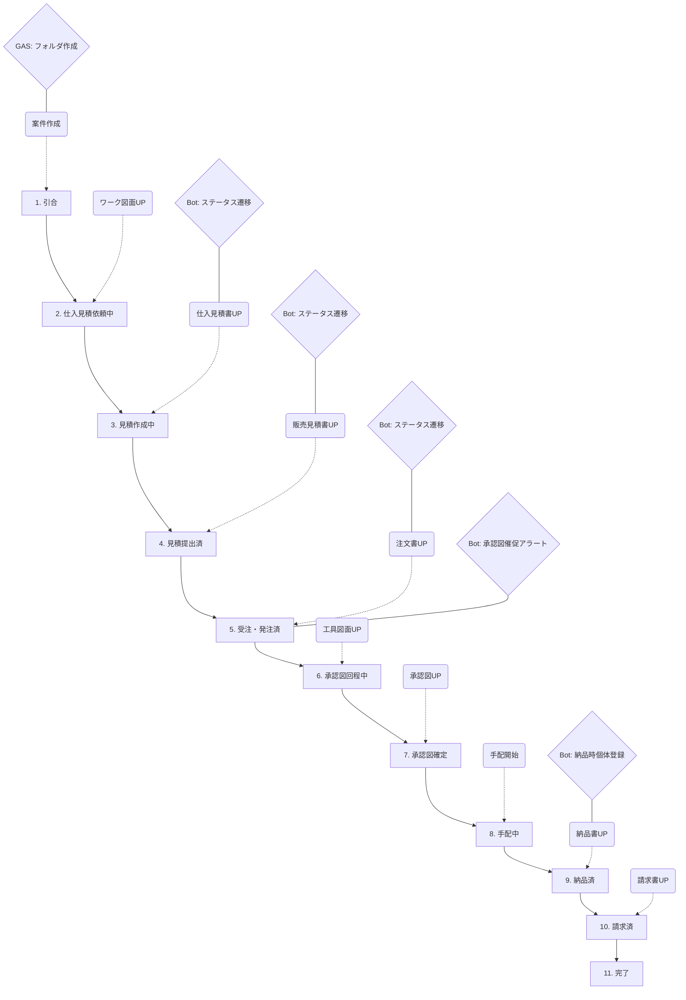

# 業務フロー＆自動化ガイド（全業務カテゴリ対応）

本システムは「書類をアップロードすると案件が勝手に進む」という自動化を核に設計されています。各業務カテゴリにおける「ユーザーの操作」と「裏側の自動化」を整理します。

---

## 1. 工具受注生産・加工受託フロー（最長ルート）

最も要素が多い「受注生産工具」を例に、PDCAサイクルがどう回るかを可視化します。

### ワークフローチャート

### 詳細対照表：ユーザー操作 vs システム自動化

| フェーズ | ユーザーの具体的操作 (AppSheet) | 裏側で行われる自動化 (GAS/Bot) |
|---|---|---|
| **P: 計画** | **1. [T1] 案件を追加する** （タイトル・大分類・小分類を入力） | **[GAS]** Google Driveに `/[会社名]/[案件ID]/` フォルダを自動生成。 |
| | **2. [A2] ワーク諸元を入力する** （モジュール・圧力角・ワーク図面等） | **[AppSheet]** 案件(T1D)とリレーション。過去の類似諸元があれば引用選択可能。 |
| **D: 実行** | **3. [T5] ワーク図面をアップロード** | **[Bot]** ステータスを「引合」→「仕入見積依頼中」へ。 |
| | **4. [T5] 仕入見積書（メーカー製）をUP** | **[Bot]** ステータスを「見積作成中」へ。 |
| | **5. [T2] 販売見積を作成・[T5] UP** | **[Bot]** ステータスを「見積提出済」へ。7日後に「フォロー」のリマインドを飛ばす。 |
| | **6. [T5] 顧客からの注文書をUP** | **[Bot]** ステータスを「受注・発注済」へ。メーカーへの発注書もセットで作成(Action)。 |
| **C: 評価** | **7. [T5] 工具図面・承認図をUP** | **[Bot]** ステータスを「承認図確定」へ。承認図を個体管理(A1)の図面として仮登録。 |
| | **8. [T5] 納品書（受領印付）をUP** | **[Bot]** ステータスを「納品済」へ。 **[重要]** A1個体テーブルに「製造番号」をキーとして正式登録し、ライフサイクル管理を開始。 |
| **A: 改善** | **9. [T1] 判断メモを記入する** | **[蓄積]** 「なぜこのメーカーにしたか」「なぜ失注したか」の判断理由をAIの分析用データとして保存。 |
| | **10. [T5] 請求書をUP** | **[Bot]** ステータスを「請求済」へ。20日締めリストに抽出。 |

---

## 2. 業務カテゴリ別の特化フロー

### (a) 修理・オーバーホール（同行修理パターン）
- **ユーザー操作**: 修理に同行後、[T6]作業履歴に「作業時間」「同行費用あり」を入力。
- **自動化**: 設定マスタの「日額」×「日数」で費用を自動算出。納品書・請求書作成Actionへ反映。
- **PDCA**: 修理履歴を蓄積し、同じ個体(A1)で故障が頻発すれば「新品買い替え提案」の根拠にする。

### (b) 加工受託（工具支給パターン）
- **ユーザー操作**: 加工案件(T1)を作成後、支給工具を作るための工具開発案件(T1子)を「親案件ID」に自分のIDを指定して作成。
- **自動化**: 子案件のステータスが「納品済」になると、親案件の担当者に「加工用工具が完成しました。加工を開始してください」と通知。

### (c) 中古工作機械 買取・販売
- **ユーザー操作**: 買取時(T2/T3)に「個体(A1)」を作成。[T6]作業履歴に整備内容とコストを記録。
- **自動化**: 買取コスト(A1紐づき)と、販売見積(T2)を突合し、**個体ごとの純利益**をリアルタイム表示。

---

## 3. PDCAを回すための「判断ログ」の活用

各案件の完了時（または失注時）に、ユーザーは [T1]判断メモ（DecisionLog）を入力します。

- **Plan (計画)**: 設定した目標利益率。
- **Do (実行)**: 実際に行った交渉・価格設定。
- **Check (検証)**: 最終的な利益と、顧客の反応。
- **Act (改善)**: 
    - **AIの役割**: 過去の判断メモから「この顧客は納期重視なので、A社より10%高くてもB社を選ぶ傾向がある」といった示唆を出し、次回の見積作成をアシスト。
    - **若手教育**: ベテランの「判断メモ」を検索し、なぜその価格にしたかの背景を学ぶ教材とする。
