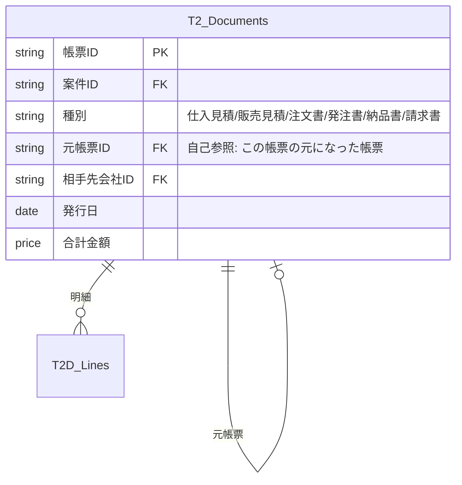

# ER図の構造分析 ─ 各テーブルの役割と3つの課題

## 現行の各テーブル解説

### マスタ系（変わりにくいデータ）

| ID | テーブル名 | ひとことで | 具体例 |
|---|---|---|---|
| **M1** | 会社マスタ | 「**誰と取引するか**」の台帳 | 〇〇歯車工業（顧客）、△△工具メーカー（仕入先）、□□修理業者 |
| **M2** | 担当者マスタ | M1に所属する「**人**」の台帳 | 山田太郎（〇〇歯車の購買部長）、鈴木（自社営業） |
| **M3** | 工具価格マスタ | 研磨・コーティングの**価格表** | 外径50mm未満 × 厚み10mm未満 → 基本研磨料2,000円 |
| **M4** | 設定マスタ | システム全体の**定数** | 同行修理日額=60,000円、研磨アラート閾値=5回 |

### 個体管理系（現物を追跡するデータ）

| ID | テーブル名 | ひとことで | 具体例 |
|---|---|---|---|
| **A1** | 個体管理 | **製造番号で追跡する「モノ」** | 製造番号 HOB-2024-001（ホブカッター）、M/C-SN-5678（中古旋盤） |
| **A2** | ワーク諸元 | **「何を削るか」** の技術仕様 | m2.0 PA20° 右ネジレ 3条（このワークを削るための工具を作る） |

### トランザクション系（日々動くデータ）

| ID | テーブル名 | ひとことで | 具体例 |
|---|---|---|---|
| **T1** | 案件管理 | 全業務の**ハブ（案件のタイトル）** | 「〇〇歯車様 工具製作依頼」 |
| **T2** | 見積管理 | 仕入/販売の**見積書** | メーカーへの仕入見積依頼、顧客への販売見積書 |
| **T3** | 注文管理 | 受注/発注の**注文書** | 顧客からの注文書、メーカーへの発注書 |
| **T4** | 納品・請求 | **納品書と請求書** | 納品日、請求日、入金確認 |
| **T5** | 図面・資料 | 案件に紐づく**全ファイル** | ワーク図面、工具図面、承認図、見積書PDF等 |
| **T6** | 作業履歴 | 修理・研磨などの**実績記録** | 研磨0.5mm実施、同行修理4時間 |

### 現行ER図の連携

```mermaid
erDiagram
    M1["M1 会社"] ||--o{ M2["M2 担当者"] : "所属"
    M1 ||--o{ T1["T1 案件"] : "顧客/仕入先"
    M1 ||--o{ A1["A1 個体"] : "所有/製造"
    A2["A2 諸元"] ||--o{ T1 : "対象ワーク"
    A1 ||--o{ T1 : "対象個体"
    T1 ||--o{ T2["T2 見積"] : "1案件に複数"
    T1 ||--o{ T3["T3 注文"] : "1案件に複数"
    T1 ||--o{ T4["T4 納品請求"] : "1案件に複数"
    T1 ||--o{ T5["T5 図面"] : "1案件に複数"
    T1 ||--o{ T6["T6 作業履歴"] : "1案件に複数"
    T2 ||--o{ T2D["T2D 見積明細"] : "明細"
```

---

## 課題① ワーク諸元（A2）のリレーション

### 問題
A2 は現在 T1（案件）にしか紐づいていない。しかし実際の業務では：
- **A2（ワーク諸元）** → このワークを削るための **A1（工具個体）** に紐づくべき
- **加工受託** の場合 → A2（歯車諸元）が案件の核になる

### 改善案
```
A2 ワーク諸元 ←→ A1 個体（工具）  ：「この工具はこのワークを削るためのもの」
A2 ワーク諸元 ←── T1D 案件明細    ：「この案件明細はこのワークの加工」
```

A1 個体テーブルに `諸元ID (Ref→A2)` を追加し、**「この工具は、このワーク諸元の歯車を切るためのもの」** というリレーションを作る。

---

## 課題② 帳票（見積・注文・納品・請求）の紐づけ

### 問題
T2/T3/T4 がそれぞれ独立してT1に紐づいているが、実際の業務では：

```
仕入見積書  ──→  発注書      （同じ内容・同じ金額）
販売見積書  ──→  注文書（受注）──→  納品書  ──→  請求書
```
この **横の紐づけ** が表現できていない。

### 改善案A: 帳票を1テーブルに統合する
> 見積・注文・納品・請求をすべて**1つの「帳票テーブル」**にまとめ、「種別」Enumで区別する。

| テーブル | 役割 |
|---|---|
| **T2. 帳票 (Documents)** | 仕入見積/販売見積/注文書/発注書/納品書/請求書 を統合 |
| **T2D. 帳票明細 (DocumentLines)** | 各帳票の中身（品目・数量・単価・金額） |

**メリット:**
- 仕入見積 → 発注書を作るとき、**同じ明細をコピーするだけ**
- 販売見積 → 納品書 → 請求書も同様に**明細を引き継ぎ**
- `元帳票ID (Ref→T2自身)` で「この発注書は、あの仕入見積から作った」を表現



### 改善案B: T2/T3/T4を維持し、参照で繋ぐ
T3に「元見積ID (Ref→T2)」、T4に「元注文ID (Ref→T3)」を追加。

> [!TIP]
> **推奨は改善案A（帳票統合）**。
> 理由：AppSheetでは、テーブル数が少ない方がUI設計がシンプルになり、
> 「見積書をコピーして注文書を作る」操作がAction一発で実現できる。

---

## 課題③ 案件明細（T1D）の不在

### 問題
1件の案件「工具製作依頼」に複数の工具（工具1、工具2）が含まれるケースに対応できない。

```
案件: 「〇〇歯車様 工具製作依頼」
  ├── 工具1: ホブカッター m2.0 PA20°
  ├── 工具2: シェービングカッター m1.5 PA14.5°
  └── 工具3: ブローチ
```

### 改善案: T1D「案件明細」テーブルを新設

| カラム名 | Type | 備考 |
|---|---|---|
| 明細ID | Text Key | `"DI-" & UNIQUEID()` |
| 案件ID | Ref→T1 | Is a part of: ON |
| 品名・内容 | Text Label | 「ホブカッター m2.0」等 |
| 諸元ID | Ref→A2 | ワーク諸元と紐づけ |
| 個体ID | Ref→A1 | 製造後に紐づけ |
| 数量 | Number | |
| 備考 | LongText | |

これにより：
- **T1（案件）は「タイトル」**、**T1D（明細）は「中身」**
- 帳票（T2）の明細（T2D）は、このT1Dの品目を参照できる
- A2（ワーク諸元）はT1Dに紐づくため、**1案件に複数ワーク**に対応

---

## 改善後のER図

```mermaid
erDiagram
    M1["M1 会社"] ||--o{ M2["M2 担当者"] : "所属"
    M1 ||--o{ T1["T1 案件(タイトル)"] : "顧客/仕入先"
    M1 ||--o{ A1["A1 個体(モノ)"] : "所有/製造"

    T1 ||--o{ T1D["T1D 案件明細(中身)"] : "1案件に複数品目"
    A2["A2 諸元(ワーク)"] ||--o{ T1D : "何を削るか"
    A1 ||--o{ T1D : "どの工具か"
    A2 ||--o{ A1 : "この工具はこのワーク用"

    T1 ||--o{ T2["T2 帳票(統合)"] : "見積/注文/納品/請求"
    T2 ||--o{ T2D["T2D 帳票明細"] : "明細"
    T1D ||--o{ T2D : "案件品目を参照"
    T2 ||--o| T2 : "元帳票(自己参照)"

    T1 ||--o{ T5["T5 図面・資料"] : "ファイル"
    T1 ||--o{ T6["T6 作業履歴"] : "修理/研磨記録"
    A1 ||--o{ T5 : "個体の図面"
    A1 ||--o{ T6 : "個体の作業履歴"
    M3["M3 価格マスタ"] ||--o{ T6 : "価格算出"
```

### 改善のまとめ

| # | 課題 | 解決策 |
|---|---|---|
| ① | A2がA1と繋がっていない | A1に `諸元ID (Ref→A2)` を追加 |
| ② | 帳票間の横の紐づけがない | T2/T3/T4を**1つの帳票テーブル**に統合 + `元帳票ID`で自己参照 |
| ③ | 案件に「中身」がない | **T1D 案件明細**を新設。1案件=複数品目に対応 |
