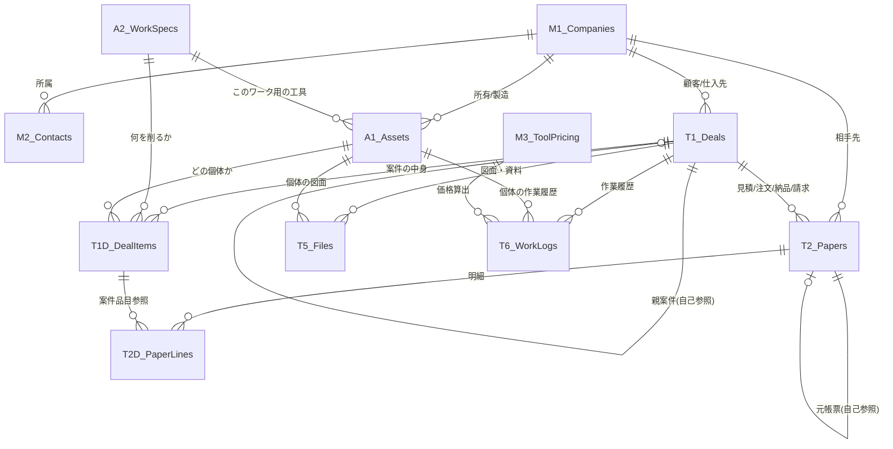

# 統合設計プラン v4.0（最終版）— 歯車製造業特化・商社向け案件管理システム

> v3.0 のレビューで発見した **8つの矛盾・懸念** をすべて解消した最終設計。

---

## v3.0 → v4.0 改善サマリー

| # | v3.0の問題 | v4.0での解決 |
|---|---|---|
| ① | T2/T3/T4が独立しており帳票間の紐づけがない | **T2帳票テーブルに統合** + `元帳票ID`で自己参照 |
| ② | 案件に「中身（明細）」がない | **T1D案件明細を新設** |
| ③ | A1個体とA2諸元が繋がっていない | A1に**諸元ID (Ref→A2)** を追加 |
| ④ | T5（図面資料）とT2（見積の添付PDF）で書類管理が二重 | T2からPDF添付を削除、**T5に一本化** |
| ⑤ | ステータスフローが工具受注生産に偏っている | **業務別の分岐対応ルール**を追加 |
| ⑥ | T1に諸元ID/個体IDの直接参照があるがT1D新設で不要に | T1から削除、**T1Dに移動** |
| ⑦ | テーブル数が13→**12テーブル**に最適化 | T3/T4をT2に統合 |
| ⑧ | 加工受託で工具支給案件の連鎖が表現できない | T1に**親案件ID (Ref→T1自身)** を追加 |

---

## データベース設計（全12テーブル）

### 🟡 マスタ系 — 4テーブル（v3.0から変更なし）

#### M1. 会社マスタ (Companies)
| カラム名 | Type | Key/Label | 備考 |
|---|---|---|---|
| 会社ID | Text | ✅ Key | `"C-" & UNIQUEID()` |
| 会社名 | Text | ✅ Label | |
| 会社名カナ | Text | | ソート・検索用 |
| 取引区分 | EnumList | | 顧客/仕入先/メーカー/修理業者/協力工場 |
| 郵便番号 | Text | | |
| 住所 | Text | | |
| 電話番号 | Phone | | |
| FAX番号 | Phone | | |
| 締日 | Enum | | 20日/末日/15日 等 |
| 支払条件 | Text | | 翌月末振込 等 |
| 備考 | LongText | | |

#### M2. 担当者マスタ (Contacts)
| カラム名 | Type | Key/Label | 備考 |
|---|---|---|---|
| 担当者ID | Text | ✅ Key | `"P-" & UNIQUEID()` |
| 会社ID | Ref→M1 | | |
| 氏名 | Text | ✅ Label | |
| 区分 | Enum | | 社外/社内 |
| 部署 | Text | | |
| 役職 | Text | | |
| メール | Email | | |
| 電話番号 | Phone | | |
| 名刺画像 | Image | | `Show_If: [区分]="社外"` |
| 電子印影URL | Image | | `Show_If: [区分]="社内"` |
| 退職/異動フラグ | YesNo | | |

```markdown
#### M3. 工具価格マスタ (ToolPricing)
> **画像でいただいた「ホブ・ピニオンカッター価格表（TiN等）」に対応するための新設計**
> 直径（Φ）と全長（厚み）の2Dマトリクス構造を持ち、DB処理や除膜処理の係数も持たせます。

| カラム名 | Type | Key/Label | 備考 |
|---|---|---|---|
| 価格ID | Text | ✅ Key | `UNIQUEID()` |
| 区分 | Enum | ✅ Label | 研磨 / コーティング |
| コーティング種別 | Enum | | TiN / TiAlN / TiCN / マーキュリー 等（研磨時は空値） |
| 直径_最大 | Decimal | | mm (「≦Φ30」なら `30` を入力) |
| 全長_最大 | Decimal | | mm (厚み。表の「≦20」なら `20` を入力) |
| 基本価格 | Price | | マトリクスで交差する価格（例：Φ30以下×全長20以下＝2,320円） |
| DB処理割増率 | Decimal | | `1.2` (DB処理は20%UP) |
| 除膜処理掛率 | Decimal | | `0.5` (除膜処理は上記単価の50%) |

**利用時の関数イメージ（T6.作業履歴での価格決定）:**
```appsheet
ANY(
  SELECT(
    ToolPricing[基本価格],
    AND(
      [区分] = [_THISROW].[作業区分],
      [コーティング種別] = [_THISROW].[コーティング膜種],
      [直径_最大] >= [_THISROW].[個体ID].[外径],
      [全長_最大] >= [_THISROW].[個体ID].[厚み]
    )
  )
  // より厳密には、該当する中で最小の[直径_最大][全長_最大]を持つ行を抽出するロジックを組みます。
) * IF([DB処理あり]=TRUE, 1.2, 1.0)
```
```

#### M4. 設定マスタ (Settings)
| カラム名 | Type | Key/Label | 備考 |
|---|---|---|---|
| 設定キー | Text | ✅ Key/Label | `同行修理日額`, `利益率警告閾値`, `研磨回数アラート閾値` |
| 設定値 | Text | | |
| 説明 | Text | | |

---

### 🟢 個体・諸元系 — 2テーブル

#### A1. 個体管理 (Assets)
> **v4.0変更: `諸元ID (Ref→A2)` を追加**

| カラム名 | Type | Key/Label | 備考 |
|---|---|---|---|
| 個体ID | Text | ✅ Key | 製造番号 or シリアル番号 |
| 個体名称 | Text | ✅ Label | |
| 個体区分 | Enum | | 工具/機械 |
| 所有会社ID | Ref→M1 | | 納品先（誰のモノか） |
| メーカー会社ID | Ref→M1 | | 製造元 |
| **諸元ID** | **Ref→A2** | | **「このワークを削るための工具」** `Show_If: [個体区分]="工具"` |
| 初回案件ID | Ref→T1 | | どの案件で初めて登場したか |
| 工具図面URL | File | | `Show_If: [個体区分]="工具"` |
| 外径 | Decimal | | `Show_If: [個体区分]="工具"` |
| 厚み | Decimal | | `Show_If: [個体区分]="工具"` |
| 内径 | Decimal | | `Show_If: [個体区分]="工具"` |
| 材質 | Text | | |
| 累計研磨回数 | Number | | T6登録時に自動インクリメント |
| 最終メンテ日 | Date | | |
| 型式 | Text | | `Show_If: [個体区分]="機械"` |
| 年式 | Text | | `Show_If: [個体区分]="機械"` |
| 仕様書URL | File | | `Show_If: [個体区分]="機械"` |
| 備考 | LongText | | |

#### A2. ワーク諸元 (WorkSpecs)
（v3.0から変更なし）

| カラム名 | Type | Key/Label | 備考 |
|---|---|---|---|
| 諸元ID | Text | ✅ Key | `"WS-" & UNIQUEID()` |
| ワーク名称 | Text | ✅ Label | |
| 加工区分 | Enum | | 内径/外径/溝/スプライン/キー溝 等 |
| モジュール/ピッチ | Decimal | | |
| 圧力角 | Decimal | | |
| ねじれ方向 | Enum | | 右/左/ストレート |
| 条数 | Number | | |
| ワーク図面URL | File | | |
| 数量 | Number | | 加工予定数 |
| 備考 | LongText | | |

---

### 🔵 トランザクション系 — 5テーブル（v3.0から大幅変更）

#### T1. 案件管理 (Deals)
> **v4.0変更: 諸元ID/個体IDを削除（→T1Dへ移動）、親案件IDを追加**

| カラム名 | Type | Key/Label | 備考 |
|---|---|---|---|
| 案件ID | Text | ✅ Key | `"D-" & TEXT(TODAY(),"YYMMDD") & "-" & UNIQUEID()` |
| 案件名 | Text | ✅ Label | 「〇〇歯車様 工具製作依頼」等 |
| 大分類 | Enum | | 工具販売/加工受託/新品機械/中古機械/修理OH |
| 小分類 | Enum | | 大分類に応じて動的表示（下記参照） |
| ステータス | Enum | | 下記「ステータス定義」参照 |
| 顧客会社ID | Ref→M1 | | |
| 仕入先会社ID | Ref→M1 | | メーカーまたは修理業者 |
| 自社担当者ID | Ref→M2 | | `Valid_If: [区分]="社内"` |
| **親案件ID** | **Ref→T1** | | **自己参照（加工受託+工具支給等の案件連鎖）** |
| 発生日 | Date | | `TODAY()` |
| 希望納期 | Date | | |
| ステータス更新日 | Date | | ステータス変更時に自動記録（滞留アラート計算用） |
| ドライブフォルダURL | URL | | GAS自動生成 |
| 判断メモ | LongText | | なぜ受けた/断ったか（教育資産） |
| 備考 | LongText | | |

**小分類ルール:**

| 大分類 | 小分類の選択肢 |
|---|---|
| 工具販売 | カタログ品 / 受注生産 |
| 加工受託 | （小分類なし or 加工種別） |
| 新品機械 | （小分類なし） |
| 中古機械 | 買取 / 販売 |
| 修理OH | メーカー委託 / 同行修理 / 業者委託 |

#### T1D. 案件明細 (DealItems) ← 🆕 新設
> **1つの案件に複数の品目が含まれるケースに対応。**

| カラム名 | Type | Key/Label | 備考 |
|---|---|---|---|
| 明細ID | Text | ✅ Key | `"DI-" & UNIQUEID()` |
| 案件ID | Ref→T1 | | **Is a part of: ON** |
| 品名・内容 | Text | ✅ Label | 「ホブカッター m2.0 PA20°」等 |
| 諸元ID | Ref→A2 | | ワーク諸元と紐づけ |
| 個体ID | Ref→A1 | | 製造後に紐づけ（納品時に確定） |
| 数量 | Number | | Initial: 1 |
| 備考 | LongText | | |

**使い方の例:**
```
案件: 「〇〇歯車様 工具製作依頼」(T1)
  ├── 明細1: ホブカッター m2.0 PA20° ×2本 (T1D) → 諸元A → 個体HOB-001, HOB-002
  └── 明細2: シェービングカッター m1.5 ×1本 (T1D) → 諸元B → 個体SHV-001
```

#### T2. 帳票管理 (Papers) ← 🔄 T2/T3/T4を統合
> **見積・注文・納品・請求をすべて1テーブルで管理。**
> `元帳票ID`で「仕入見積→発注書」「販売見積→納品書→請求書」の流れを表現。

| カラム名 | Type | Key/Label | 備考 |
|---|---|---|---|
| 帳票ID | Text | ✅ Key | `"P-" & UNIQUEID()` |
| 案件ID | Ref→T1 | | **Is a part of: ON** |
| 種別 | Enum | ✅ Label | **見積依頼書/仕入見積書/販売見積書/注文書/発注書/納品書/請求書** |
| 元帳票ID | Ref→T2 | | **自己参照**。「この発注書は、あの仕入見積から作った」 |
| 相手先会社ID | Ref→M1 | | 仕入系→メーカー、販売系→顧客 |
| 発行日 | Date | | `TODAY()` |
| 有効期限 | Date | | `Show_If: [種別] IN ("仕入見積","販売見積")` |
| 合計金額 | Price | | `SUM(Related 帳票明細s[金額])` |
| 承認図面フラグ | YesNo | | `Show_If: [種別]="発注書"` |
| 入金確認 | YesNo | | `Show_If: [種別]="請求書"` |
| 入金日 | Date | | `Show_If: [入金確認]=TRUE` |
| 備考 | LongText | | |

**帳票の流れ（自己参照による連鎖）:**
```
仕入見積(P-001) ──元帳票──→ 発注書(P-003)
販売見積(P-002) ──元帳票──→ 注文書(P-004) ──元帳票──→ 納品書(P-005) ──元帳票──→ 請求書(P-006)
```

**【重要変更: GASによるディープコピー＆PDF生成】**
AppSheetの標準Actionでは「明細(T2D)を含めたディープコピー」や「顧客指定フォーマットのPDF生成」に限界があるため、以下の処理は**すべてGoogle Apps Script (GAS) に委譲**します。

*   **帳票作成 (ディープコピー)**: AppSheet上で「見積から注文を作成」フラグを立てると、Webhook経由でGASが発火し、スプレッドシート上でT2および紐づくT2D行を直接複製します。
*   **PDF帳票生成**: AppSheetのAutomation(Document生成)は使用せず、GASが「スプレッドシートの専用テンプレート」にデータを流し込み、PDF化してDriveの該当案件フォルダへ自動保存します。

#### T2D. 帳票明細 (PaperLines)
> 各帳票の中身。**T1D（案件明細）を参照**し、案件品目と帳票品目を紐づける。

| カラム名 | Type | Key/Label | 備考 |
|---|---|---|---|
| 明細ID | Text | ✅ Key | `"PL-" & UNIQUEID()` |
| 帳票ID | Ref→T2 | | **Is a part of: ON 必須** |
| 案件明細ID | Ref→T1D | | 案件品目への紐づけ（任意） |
| 項目名 | Text | ✅ Label | |
| 数量 | Number | | Initial: 1 |
| 単位 | Enum | | 個/本/式/時間/日 |
| 単価 | Price | | |
| 金額 | Price | | Formula: `[数量] * [単価]` |
| 備考 | Text | | |

#### T5. 図面・資料管理 (Files)
> **全書類の一元管理。ステータス自動遷移の「引き金」。**

| カラム名 | Type | Key/Label | 備考 |
|---|---|---|---|
| 資料ID | Text | ✅ Key | `"F-" & UNIQUEID()` |
| 案件ID | Ref→T1 | | **Is a part of: ON** |
| 個体ID | Ref→A1 | | 個体に直接関連する場合 |
| ファイル名 | Text | ✅ Label | |
| カテゴリ | Enum | | 仕入見積書/販売見積書/注文書/発注書/ワーク図面/工具図面/承認図/納品書/請求書/仕様書/写真/報告書/その他 |
| サフィックス | Enum | | A/B/C/D/E（版管理） |
| ファイル | File | | AppSheet上でアップロード |
| 登録日 | Date | | `TODAY()` |
| 備考 | Text | | |

#### T6. 作業履歴 (WorkLogs)
（v3.0から変更なし）

| カラム名 | Type | Key/Label | 備考 |
|---|---|---|---|
| 履歴ID | Text | ✅ Key | `"W-" & UNIQUEID()` |
| 案件ID | Ref→T1 | | Is a part of: ON |
| 個体ID | Ref→A1 | | 処理対象の工具 |
| 作業区分 | Enum | | 研磨/コーティング/修理/オーバーホール/点検 |
| 作業日 | Date | | `TODAY()` |
| 研磨量 | Decimal | | `Show_If: [作業区分]="研磨"` |
| コーティング膜種 | Enum | | TiN / TiAlN / TiCN / マーキュリー / なし |
| **DB処理有無** | **YesNo** | | **`Show_If: [作業区分]="コーティング"` (価格20%UP)** |
| **除膜処理有無** | **YesNo** | | **`Show_If: [作業区分]="コーティング"` (価格50%減額ベース)** |
| 算出価格 | Price | | **価格マスタ(M3)から、個体の[外径][厚み]を元にマトリクス検索・自動計算** |
| 同行費用有無 | YesNo | | `Show_If: [作業区分]="修理"` |
| 同行日数 | Decimal | | `Show_If: [同行費用有無]=TRUE` |
| 同行費用 | Price | | Formula: `[同行日数] * 設定マスタ.同行修理日額` |
| 作業写真 | Image | | AppSheetから直接撮影 |
| 作業メモ | LongText | | |

---

### 🟣 UI専用 — メニュー階層管理 (L1_Menu) 🔄 大幅アップデート

> **AppSheetのUIを「業務タスク実行型」の多階層ランチャーとして再構築。**
> ユーザーが「次に何をすべきか」迷わないよう、大分類 → 業務タスク → 具体的な入力フォーム という階層（レイヤー）を持たせます。

| カラム名 | Type | Key/Label | 備考 |
|---|---|---|---|
| メニューID | Text | ✅ Key | M-01, M-02... |
| メニュー名 | Text | ✅ Label | 「図面登録」「見積書作成」等 |
| 親メニューID | Ref→L1_Menu | | トップ階層なら空白。自己参照で階層を構築 |
| アイコン | Image | | |
| 遷移先ビュー名 | Text | | フォームではなくダッシュボードや選択リスト画面を指定することも |
| 表示順 | Number | | |

#### 📱 多階層メニューの構成案（工具販売・加工受託の場合）

**【第1レイヤー（トップ画面）: 大分類の選択】**
*   🔧 工具販売
*   🏭 加工受託
*   ✨ 新品機械 ... （これらをクリックすると、紐付く第2レイヤーのボタン一覧が表示される）

**【第2レイヤー: アクションの選択（工具販売の例）】**
ユーザーのアクション（やりたい事）ベースで各種フォームへ誘導します。案件が紐づくアクションの場合は、まず「対象となる案件一覧」を表示させてからフォームを開かせます。

1. **図面登録（案件発生）**
   *   *アクション*: 新規フォームを開く。図面データをアップロードし、同時に案件基本情報とワーク諸元を入力する。
2. **仕入見積書 登録**
   *   *アクション*: 既存案件を選択し、メーカーや加工先から届いた「仕入見積額」を入力、かつPDFをT5(図面・資料管理)へ保存する。
3. **販売見積書 作成**
   *   *アクション*: 案件に紐づく仕入見積を元に、掛け率を乗せて販売価格を決定。販売見積データ(T2)を作成し、GASで顧客向けPDFを出力するボタンを表示。
4. **注文書 登録**
   *   *アクション*: 顧客から届いた注文書(PDF)をT5に保管し、案件を受注確定させる。
5. **発注書 作成**
   *   *アクション*: 仕入見積書を元に、メーカー向けの注文内容を確定し、専用フォーマットの発注書PDFをGASで出力する。
6. **工具図面 登録**
   *   *アクション*: メーカーから届いた「承認前工具図面」を保管。顧客の承認（印鑑）を得るまでのリードタイムをタスク化し、承認されればメーカーへ返送（ステータス更新）する。
7. **納品書 発行**
   *   *アクション*: 出荷対象の案件を選び、納品書データを作成・発行処理を行う。
8. **請求書 発行**
   *   *アクション*: 納品済みのデータから請求書データを作成し、次回の請求発行処理を行う。

> 💡 **ポイント**: このように「システム構造（テーブル）」と「ユーザー操作（メニュー）」を切り離すことで、裏側のテーブル（T1, T2, T5...など）が複雑でも、ユーザーは「自分が今から何をしたいか」を選ぶだけで正しいデータ登録が完了するようになります。

---

## ER図（v4.0 最終版）



---

## ステータスフロー（業務別分岐対応）

### 基本フロー（主要なステータス変化）

| # | ステータス | 遷移トリガー | 備考 |
|---|---|---|---|
| 1 | 引合 | 案件作成時 | 全業務共通の初期値 |
| 2 | 相見積依頼中 | 諸元・図面の登録後 | **[工具販売/加工受託]** 複数社へ仕入見積を依頼 |
| 3 | 見積作成中 | 🔄 仕入見積書UP | |
| 4 | 見積提出済 | 🔄 販売見積書UP | |
| 5 | 受注 | 🔄 注文書  | |
| 6 | 発注済 | 発注書UP | |
| 7 | 手配中 |手動 | 加工や製造の進行待ち | |
| 8 | 納品済 | 🔄 納品書UP  | |
| 9 | 請求済 | 🔄 請求書UP | |
| 10 | 入金確認済 | T2(請求書)の入金確認=TRUE | |
| 11| 完了 | 手動 | |
| 12 | 失注 | 手動 | |

### 工具新作時の特有フロー（承認図プロセス）

| # | ステータス | 遷移トリガー | 備考 |
|---|---|---|---|
| 5.1 | 承認図作成中 | 発注後 | メーカーが図面を引いている状態 |
| 5.2 | 承認図回程中 | 🔄 工具図面UP | お客様へ提出・確認依頼中 |
| 5.3 | 承認図確定 | 🔄 承認図UP | 承認印済みの図面をメーカーへ返送 |

### Bot設定

```
Bot名: 書類ステータス自動更新

Event: T5に行追加
Condition: [カテゴリ] IN (仕入見積書, 販売見積書, 注文書, 発注書, 工具図面, 承認図, 納品書, 請求書)

Action: T1のステータスを更新
  IFS(
    [カテゴリ]="仕入見積書", "見積作成中",
    [カテゴリ]="販売見積書", "見積提出済",
    OR([カテゴリ]="注文書", [カテゴリ]="発注書"), "受注・発注済",
    [カテゴリ]="工具図面", "承認図回程中",
    [カテゴリ]="承認図", "承認図確定",
    [カテゴリ]="納品書", "納品済",
    [カテゴリ]="請求書", "請求済"
  )
```

> **相見積もりとデータ再利用の仕組み（One-Time Data Entry）**: 
> 1. まず `T1_Deals` と `T1D_DealItems` に諸元などの引合情報を一度だけ入力します。
> 2. その情報をベースに、AppSheet上で複数のメーカーを宛先とした「見積依頼書 (T2)」をワンクリックで生成（データ流用）できます。これにより、**「どのメーカーに依頼をかけたか」が T2_Papers に履歴として残ります**。
> 3. メーカーから仕入見積が届いたら、対応する「見積依頼書」を「仕入見積書」に更新するか、紐付ける形で記録します。これにより、二度手間を防ぎつつ、プロセスの追跡が容易になります。

---

## 🚨 定期通知・滞留アラート Bot (事故防止)

`T1_Deals` に追加した `ステータス更新日` を活用し、各工程での「滞留日数」を計算してアラートを出します。

| Bot名 | 条件 | アクション |
|---|---|---|
| 見積回答遅延アラート | ステータス「相見積依頼中」かつ `TODAY() - [ステータス更新日] >= 3` | 担当者に「メーカーへ見積状況を確認してください」と通知 |
| 見積フォローアラート | ステータス「見積提出済」かつ `TODAY() - [ステータス更新日] >= 7` | 担当者に顧客フォローを促す通知 |
| 承認図催促アラート | ステータス「承認図作成中」かつ `TODAY() - [ステータス更新日] >= 14` | メーカーへ承認図の進捗確認を促す通知 |
| 研磨回数リマインド | A1累計研磨回数 ≥ 閾値 | お客様へ新品購入の提案リマインド |
| 締日請求リマインド | ステータス「納品済」かつ 毎月指定日 | 請求忘れ防止のリスト通知 |

---

## 実装ロードマップ (GAS連携強化版)

| Phase | 内容 | 成果物 |
|---|---|---|
| **0. 設計確定** ← 今ここ | テーブル設計の最終承認、GASアーキテクチャへのシフト | この設計書 |
| **1. DB構築** | GASで全12テーブルを一括生成 | `v4_db_setup.gs` |
| **2. AppSheetスキーマ** | Type/Ref/Key/Label/Formula設定 | 設定手順書 |
| **3. ランチャーUI** | ギャラリー+LINKTOFORMによる超シンプルフロント画面 | ホーム画面 |
| **4. GASバックエンド (Core)** | ID採番/Webhook受信基盤/フォルダ自動生成 | `v4_gas_core.gs` |
| **5. GASバックエンド (Advanced)** | **[New]** 帳票ディープコピー(見積→注文等) / テンプレートPDF生成 | `v4_gas_papers.gs` |
| **6. Automation** | 書類駆動ステータス遷移Bot + GAS発火用Webhook設定 | AppSheet Bot |
| **7. ダッシュボード構築** | **[New]** 閲覧・集計用の Looker Studio ダッシュボード | Looker Studio |
| **8. 検証** | 各業務パターンの一気通貫テスト | テスト報告書 |
