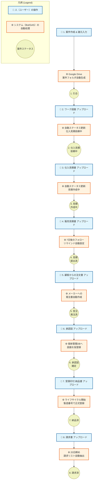

# 案件管理システム (AppSheet × GAS) v4.0 業務フロー図
## 〜「人が判断し、システムが作業する」究極にシンプルな現場〜

本資料は、新システム（v4.0）導入による業務フローの変化と、**「人が何をし、システムが何を為すか」**の役割分担を明確化するためのプレゼン用資料です。

---

## 💡 基本コンセプト

**『書類をアップロードすれば、案件が勝手に進む』**

*   **人（ユーザー）の役割**: 顧客との折衝、現場での判断、最終的な書類のアップロード。
*   **システム（Bot/GAS）の役割**: フォルダの作成、ステータス（進捗状況）の自動更新、帳票の自動生成、リマインド通知。

人間は「入力作業」から解放され、営業活動や技術的な「判断」に集中できるようになります。

---

## 📊 全体ワークフローと役割分担

以下の図は、システムにおける標準的な受注生産のフローを示しています。
青色の四角が**「人が行うアクション」**、オレンジ色の四角が**「システムが自動で行う裏側のアクション」**です。

---

## 📝 ステージ別：人とシステムのアクション対照表

システムが「入力」や「ステータス変更」を肩代わりすることで、転記ミスを防止し、業務スピードを飛躍的に向上させます。

| 業務フェーズ | 👤 人（ユーザー）がやること | ⚙️ システム（AppSheet/GAS）がやること | 🌟 導入メリット |
| :--- | :--- | :--- | :--- |
| **案件発生** | アプリで「案件作成」し、顧客名やワーク諸元をサクッと入力する。 | Google Driveに専用フォルダを自動生成。類似の過去案件データも自動提示する。 | フォルダ作成の手間ゼロ。過去の知見を即座に引き出せる。 |
| **見積依頼** | 顧客から貰った「ワーク図面」をアプリでアップロードする。 | ステータスを「仕入見積依頼中」へ自動変更。 | 現在誰がボールを持っているか、進捗が一目でわかる。 |
| **見積作成** | メーカーから届いた「仕入見積」をアップロードし、販売見積を作ってアップロードする。 | ステータスを自動更新し、提出7日後に「顧客フォローのお願い」リマインドを自動発火。 | 案件の放置や、フォロー忘れをシステムが防いでくれる。 |
| **受注・発注** | 顧客からの「注文書」をアップロードする。 | ステータスを「受注済」へ更新し、**メーカーへの発注書PDFを自動生成**する。 | 転記ミスによる発注事故が起きない。発注業務の秒速化。 |
| **図面承認** | メーカーからの「承認図」をアップロードする。 | その図面を、販売する工具の「個体管理データベース」へ仮登録する。 | 図面の迷子防止。工具データとファイルが自動で紐づく。 |
| **納品・登録** | 納品時、受領印をもらった「納品書」をアップロードする。 | 工具に製造番号を振って**正式な資産（個体）としてデータベース化**し、ライフサイクル管理を開始。 | 納品と同時に、将来のオーバーホールや再作成に向けたカルテが完成。 |
| **請求締結** | 発行した「請求書」をアップロードする。 | 案件を「完了」にし、期日（例：20日締め）の請求リストへ自動抽出する。 | 経理業務へのスムーズな連携。請求漏れをブロック。 |

---

## 🎯 まとめ

*   人は**「判断」**し、紙やPDFを**「アップロード」**するだけ。
*   システムは裏側で**「整理」「通知」「書類作成」**を全て自動でこなす。
*   結果として、データ入力の手間が極限まで減り、**本来の営業・技術提案に時間を使える**ようになります。
