# システム設計書 v5.0（改訂版）
# 株式会社清水商會 受発注管理システム

> v4.0設計 + ヒアリング回答（workflow_review_questions.md）をもとに全面改訂。
> このドキュメントをGASコード・AppSheet設定変更の直接の根拠とする。

---

## 目次

1. 業務カテゴリ別フロー整理
2. ER図（改訂版）
3. テーブル設計詳細（変更・新設テーブル）
4. ステータス設計（業務カテゴリ別）
5. 現行設計からの変更点サマリー

---

## 1. 業務カテゴリ別フロー整理

### 凡例
- `[帳票]` = T2_Papersに記録される帳票
- `[ファイル]` = T5_Filesに登録する書類
- `[作業]` = T6_WorkLogsに記録する作業
- `[費用]` = T7_RepairExpensesに記録する費用明細
- **太字** = ステータス変更が発生するタイミング

---

### カテゴリ1：オーダーメイド工具（歯切り工具・歯車加工工具）
業務の中心。複数メーカーへの相見積もり、複数形状バリアントの比較が発生する。

#### 標準フロー

```
1. 引合受付
   - T1_Deals 新規作成（業務カテゴリ=オーダーメイド工具）
   - ステータス → [引合]
   - A2_WorkSpecs（ワーク諸元）登録
   - [ファイル] ワーク図面を T5_Files へ登録

2. 見積依頼
   - T4_QuoteRequests に「見積依頼フォーム」単位で登録
     ※ 同一案件で「ベル型」「ディスク型」など形状が複数あれば、それぞれ別行として登録
   - ステータス → [見積依頼中]
   - 見積依頼書PDFをGASで生成し [ファイル] 登録

3. メーカー回答受付
   - T4D_QuoteResponses に各メーカーの回答を登録
     ※ 1つの T4_QuoteRequests に対し、複数メーカーの回答が紐づく
   - 回答が揃ったら → ステータス [見積作成中]

4. 販売見積作成
   - 採用メーカー・形状を選定（T4_QuoteRequests.採用フラグ）
   - T2_Papers（種別=販売見積書）を作成
   - GASでPDF生成 → ステータス → [見積提出済]

5. 受注
   - 顧客からの注文書受取 → [ファイル] 登録
   - ステータス → [受注]

6. 発注
   - T2_Papers（種別=発注書）を作成・PDF生成
   - ステータス → [発注済]

7. 承認図対応（新作工具の場合のみ）
   - メーカーより承認前工具図面受取 → [ファイル] 登録
   - ステータス → [承認図回程中]
   - 顧客承認後 → [ファイル] 承認済図面登録
   - ステータス → [承認図確定]

8. 納品・請求
   - T2_Papers（種別=納品書）作成・PDF生成 → ステータス → [納品済]
   - T2_Papers（種別=請求書）作成・PDF生成 → ステータス → [請求済]
   - 入金確認後 → ステータス → [完了]
```

#### 例外フロー
- **工具製作 + 加工受託の複合案件**：T1_Dealsの「親案件ID」で加工受託案件と工具製作案件を連携させる
- **工具個体の登録**：納品確定後、A1_Assetsに個体登録しT1D_DealItemsと紐づける（将来メンテ管理のため）

---

### カテゴリ2：カタログ品工具
価格表あり。電話注文→即納品という最短フローが存在する。見積ステップは全省略可。

#### 標準フロー（最短版）

```
1. 注文受付
   - T1_Deals 新規作成（業務カテゴリ=カタログ品工具）
   - ステータス → [受注]（初期値から直接）

2. 納品・請求
   - T2_Papers（種別=納品書）作成・PDF生成 → ステータス → [納品済]
   - T2_Papers（種別=請求書）作成・PDF生成 → ステータス → [請求済]
   - 入金確認後 → ステータス → [完了]
```

#### 例外フロー
- **見積が必要なケース**（数量が多い・特別値引き交渉など）：通常の見積→受注フローに戻る
- 備考：M1_Companies（仕入先マスタ）にカタログ品メーカーの「標準掛率」を持たせることで仕入単価を自動算出。
  ただし M6_Tools（工具マスタ）へのカタログ品全登録は非現実的なため、帳票明細（T2D_PaperLines）への直接入力で対応する。

---

### カテゴリ3：工具メンテナンス（研磨・コーティング・再コーティング）
見積・注文なしで引取→実施→納品→請求というシンプルフローが基本。
今後はすべてのメンテナンスを工具個体登録（A1_Assets）から始める運用とする。

#### 標準フロー

```
1. 引取・工具登録
   - 工具個体が A1_Assets 未登録であれば新規登録
   - T1_Deals 新規作成（業務カテゴリ=工具メンテナンス）
   - ステータス → [作業中]（見積・注文ステップをスキップ）

2. 作業実施
   - T6_WorkLogs 登録（作業区分=研磨 or コーティング）
   - 研磨量・コーティング膜種を入力 → 算出価格を自動計算

3. 納品・請求
   - T2_Papers（種別=作業報告書）作成・PDF生成
   - T2_Papers（種別=納品書）作成・PDF生成 → ステータス → [納品済]
   - T2_Papers（種別=請求書）作成・PDF生成 → ステータス → [請求済]
   - 入金確認後 → ステータス → [完了]
```

#### 例外フロー
- **他社工具のメンテナンス**：A1_Assetsに個体登録（所有会社IDを顧客に設定、メーカー会社IDは空可）してから同フローへ
- **見積が必要なケース**（複合作業、特殊品など）：見積提出後に受注確認を経てから作業開始

---

### カテゴリ4：加工受託（歯切り・キー溝・全加工など）
ブローカーとして機能。自社工場なし。ワークは原則 顧客 ↔ 加工先の直送。

#### 標準フロー

```
1. 引合受付
   - T1_Deals 新規作成（業務カテゴリ=加工受託）
   - ステータス → [引合]
   - A2_WorkSpecs（ワーク諸元・歯車諸元等）登録
   - [ファイル] ワーク図面を T5_Files へ登録

2. 加工業者への見積依頼
   - T4_QuoteRequests（種別=加工見積依頼）登録
   - ステータス → [見積依頼中]

3. 回答受付・販売見積作成
   - T4D_QuoteResponses に加工業者の回答を登録
   - T2_Papers（種別=販売見積書）作成・PDF生成 → ステータス → [見積提出済]

4. 受注・発注
   - 顧客から注文書受取 → [ファイル] 登録 → ステータス → [受注]
   - 加工業者へ発注書作成 → ステータス → [発注済]
   - ワーク直送手配（書類管理のみ）→ ステータス → [手配中]

5. 加工完了・納品・請求
   - 加工完了報告受取 → ステータス → [納品済]
   - T2_Papers（種別=納品書）作成・PDF生成
   - T2_Papers（種別=請求書）作成・PDF生成 → ステータス → [請求済]
```

#### 例外フロー
- **工具製作が必要なケース**：同一案件内に「加工受託」と紐づく「オーダーメイド工具」の子案件（親案件IDで連携）を作成。またはT1D_DealItemsに工具品目を追加して同一案件内で管理。
- **ワークの一時預かり**：T1_Dealsの備考欄に記載。将来的には資材管理テーブルの追加を検討。

---

### カテゴリ5：機械修理

修理主体によってフローが大きく分岐する4パターンあり。

#### パターンA：自社スタッフのみで修理

```
1. 修理依頼受付
   - T1_Deals 新規作成（業務カテゴリ=機械修理, 修理区分=自社対応）
   - ステータス → [作業中]（見積・注文なし）

2. 修理実施
   - T6_WorkLogs 登録（作業区分=修理）
   - T7_RepairExpenses に費用明細を登録（高速代・ガソリン代・昼食代・部品代・同行日当）

3. 完了後にまとめて帳票発行
   - T2_Papers（種別=作業報告書）作成・PDF生成
   - T2_Papers（種別=見積書）作成・PDF生成  ← 事後見積として発行
   - T2_Papers（種別=納品書）作成・PDF生成 → ステータス → [納品済]
   - T2_Papers（種別=請求書）作成・PDF生成 → ステータス → [請求済]
```

#### パターンB：自社スタッフ + 修理業者 同行

```
1. 修理依頼受付 → ステータス [引合]
2. 修理業者に見積依頼 → T4_QuoteRequests / T4D_QuoteResponses
3. 顧客へ見積提出 → T2_Papers（種別=販売見積書）→ ステータス [見積提出済]
4. 受注 → 修理業者へ発注 → T2_Papers（種別=発注書）→ ステータス [発注済]
5. 修理実施
   - T6_WorkLogs 登録（自社スタッフの作業分）
   - T7_RepairExpenses 登録（同行日当・高速代・ガソリン代・昼食代）
6. 作業報告書 + 納品書 + 請求書を発行
```

#### パターンC：修理業者のみ（御社は管理・手配のみ）

```
1. 修理依頼受付 → 修理業者に見積依頼 → T4_QuoteRequests
2. 顧客へ見積提出 → T2_Papers（種別=販売見積書）→ ステータス [見積提出済]
3. 受注 → 修理業者へ発注 → T2_Papers（種別=発注書）→ ステータス [発注済]
4. 修理完了報告受取 → ステータス [納品済]
5. 納品書 + 請求書を発行
```

#### パターンD：メーカーサービス（取り分10%ルール）

```
1. 修理依頼受付 → ステータス [引合]
2. メーカーから見積書受取 → [ファイル] 登録
3. 顧客へ見積提出（メーカー見積をベースに提出）→ T2_Papers（種別=販売見積書）→ ステータス [見積提出済]
4. 受注 → メーカーへ発注 → T2_Papers（種別=発注書）→ ステータス [発注済]
5. 修理完了
   - メーカーから「作業報告書 + 修正金額」の連絡を受取
   - T2_Papersの発注書に修正金額を反映（多くの場合は減額）
   - T1_Deals備考に「メーカー修正金額」を記録
6. 最終的な納品書・請求書を作成（修正後の実績金額で発行）
```

---

### カテゴリ6：中古機械販売

仕入と販売で全く別のフローが発生。同業者との共同購入もある。2種の販売価格を管理する。

#### 仕入フロー（売り手側からのアプローチ）

```
1. 機械情報収集・査定
   - T1_Deals 新規作成（業務カテゴリ=中古機械, 小分類=仕入）
   - ステータス → [引合]
   - 機械の下見・スペック確認
   - A1_Assets（個体管理）に機械情報を仮登録

2. 買取決定・搬入
   - 売買契約後 → ステータス → [仕入確定]
   - 搬入費用（重量屋）を T7_RepairExpenses（費用種別=重量輸送費）に登録
   - 倉庫搬入後のコスト（清掃・塗装・部品交換）も T7_RepairExpenses に登録

3. 販売価格設定
   - A1_Assets.販売希望価格_dealer（商社向け）を設定
   - A1_Assets.販売希望価格_user（エンドユーザー向け）を設定
   - ステータス → [在庫中]
```

#### 販売フロー（買い手側からのアプローチ）

```
1. 引合受付
   - T1_Deals 新規作成（業務カテゴリ=中古機械, 小分類=販売）
   - 既存在庫の場合は A1_Assets と紐づけ
   - ステータス → [引合]

2. 見積提出
   - T2_Papers（種別=販売見積書）作成・PDF生成
   - 顧客区分（商社 or エンドユーザー）に応じた価格で作成
   - ステータス → [見積提出済]

3. 受注・納品・請求
   - 注文書受取 → ステータス → [受注]
   - 重量屋手配（販売時の搬出費用）→ T7_RepairExpenses に登録
   - 納品書作成 → ステータス → [納品済]
   - 請求書作成 → ステータス → [請求済]
   - 入金確認 → ステータス → [完了]
   - 完了時に A1_Assets.ステータス を「売却済」に更新
```

#### 共同購入フロー（同業者と50/50）

```
- T1_Deals に共同購入フラグ・共同購入先会社IDを設定
- 仕入コストの50%を自社負担として記録
- 売却後の利益配分も T1_Deals に記録
- （将来拡張）共同購入専用のテーブルまたはフィールドで精算管理
```

---

### カテゴリ7：新品機械販売（Matrix Precision Taiwan 中心）

基本フローはオーダーメイド工具に近いが、前払い制度と重量輸送費が特徴的。

#### 標準フロー

```
1. 引合受付
   - T1_Deals 新規作成（業務カテゴリ=新品機械販売）
   - ステータス → [引合]
   - 機種・オプション情報を A1_Assets（仮登録）または T1D_DealItems に記載

2. 見積作成
   - Matrixへ見積依頼 → T4_QuoteRequests / T4D_QuoteResponses
   - 重量屋への運搬費見積も別途取得（T4_QuoteRequests 別行）
   - T2_Papers（種別=販売見積書）作成（機械代 + 運搬費を合算）
   - ステータス → [見積提出済]
   - ※仕様書は別紙とし、見積書本体は1枚に収める

3. 受注・前払い（30%）
   - 注文書受取 → ステータス → [受注]
   - T2_Papers（種別=発注書）作成（Matrix宛）
   - T2_Papers（種別=請求書, 前払フラグ=TRUE, 前払割合=30%）作成
   - 前払い入金確認後 → ステータス → [発注済（前払完了）]

4. 工場出荷時（残70%請求）
   - Matrix台湾からの出荷連絡を受取
   - T2_Papers（種別=請求書, 前払フラグ=TRUE, 前払割合=70%）作成
   - 残金入金確認後 → ステータス → [手配中]

5. 据付・試運転・納品
   - 機械到着・据付立会い（T6_WorkLogs に立会記録）
   - T7_RepairExpenses に立会交通費を登録
   - T2_Papers（種別=納品書）作成 → ステータス → [納品済]
   - 最終請求書作成 → ステータス → [請求済] → [完了]
```

#### 例外フロー（日本メーカー新品機械）
- Matrixの前払い制度なし → 通常の受注→発注→納品→請求フロー

---

## 2. ER図（改訂版）

```mermaid
erDiagram
    %% ========== マスタ系 ==========
    M1_Companies {
        string 会社ID PK
        string 会社名
        string 取引区分 "EnumList: 顧客/仕入先/メーカー/修理業者/協力工場"
        decimal 標準掛率 "カタログ品仕入用"
        string 備考
    }

    M2_Contacts {
        string 担当者ID PK
        string 会社ID FK
        string 氏名
        string 区分 "社外/社内"
        string メール
        string 電話番号
        image 電子印影URL "社内スタッフのみ"
    }

    M3_ToolPricing {
        string 価格ID PK
        string 区分 "研磨/コーティング"
        string コーティング種別 "TiN/TiAlN/TiCN等"
        decimal 直径_最大_mm
        decimal 全長_最大_mm
        decimal 基本価格
        decimal DB処理割増率
        decimal 除膜処理掛率
    }

    M4_Settings {
        string 設定キー PK
        string 設定値
        string 説明
    }

    %% ========== 個体・諸元系 ==========
    A1_Assets {
        string 個体ID PK
        string 個体名称
        string 個体区分 "工具/中古機械/新品機械"
        string 所有会社ID FK
        string メーカー会社ID FK
        string 諸元ID FK
        string 初回案件ID FK
        decimal 外径
        decimal 厚み
        decimal 内径
        string 材質
        int 累計研磨回数
        date 最終メンテ日
        string 型式 "機械のみ"
        string 年式 "機械のみ"
        decimal 仕入値 "NEW: 中古機械のコスト管理用"
        decimal 販売希望価格_dealer "NEW: 商社向け価格"
        decimal 販売希望価格_user "NEW: エンドユーザー向け価格"
        string 在庫ステータス "在庫中/売却済/廃棄"
        file 工具図面URL
        file 仕様書URL
    }

    A2_WorkSpecs {
        string 諸元ID PK
        string ワーク名称
        string 加工区分 "内径/外径/溝/スプライン/キー溝等"
        decimal モジュール_ピッチ
        decimal 圧力角
        string ねじれ方向 "右/左/ストレート"
        int 条数
        file ワーク図面URL
        string 備考
    }

    %% ========== トランザクション系 ==========
    T1_Deals {
        string 案件ID PK
        string 案件名
        string 業務カテゴリ "NEW: オーダーメイド工具/カタログ品/工具メンテナンス/加工受託/機械修理/中古機械/新品機械販売"
        string 修理区分 "機械修理のみ: 自社対応/同行修理/業者委託/メーカーサービス"
        string 中古機械小分類 "中古機械のみ: 仕入/販売/共同購入"
        string ステータス
        string 顧客会社ID FK
        string 仕入先会社ID FK
        string 自社担当者ID FK
        string 事務担当者ID FK "NEW: 納品書・請求書担当"
        string 親案件ID FK "自己参照: 複合案件連携"
        bool 失注フラグ "NEW"
        string 失注理由 "NEW: 価格負け/他社決定/顧客都合/連絡途絶/その他"
        bool 共同購入フラグ "中古機械のみ"
        string 共同購入先会社ID FK "中古機械のみ"
        date 発生日
        date 希望納期
        date ステータス更新日 "滞留アラート計算用"
        string ドライブフォルダURL
        string 判断メモ
        string 備考
    }

    T1D_DealItems {
        string 明細ID PK
        string 案件ID FK
        string 品名_内容
        string 諸元ID FK
        string 個体ID FK
        int 数量
        string 備考
    }

    T2_Papers {
        string 帳票ID PK
        string 案件ID FK
        string 種別 "見積依頼書/仕入見積書/販売見積書/注文書/発注書/作業報告書/納品書/請求書"
        string 元帳票ID FK "自己参照"
        string 相手先会社ID FK
        date 発行日
        date 有効期限
        decimal 合計金額
        bool 前払フラグ "NEW: Matrix等の前払いケース"
        decimal 前払割合 "NEW: 30% or 70%"
        bool 入金確認
        date 入金日
        string PDF_URL
        string 備考
    }

    T2D_PaperLines {
        string 明細ID PK
        string 帳票ID FK
        string 案件明細ID FK
        string 項目名
        int 数量
        string 単位 "個/本/式/時間/日"
        decimal 単価
        decimal 金額
        string 備考
    }

    T4_QuoteRequests {
        string 依頼ID PK
        string 案件ID FK
        string 形状バリアント "NEW: ベル型/ディスク型/標準 等（自由入力）"
        string 依頼種別 "工具製作/加工/修理/機械/運搬費"
        string 仕様概要
        date 依頼日
        date 回答期限
        bool 採用フラグ "NEW: この形状バリアントが採用されたか"
        string 採用理由メモ "NEW: 任意入力（価格・納期・信頼性等）"
        string 備考
    }

    T4D_QuoteResponses {
        string 回答ID PK
        string 依頼ID FK
        string 仕入先会社ID FK "回答したメーカー"
        date 回答日
        decimal 回答金額
        date 回答納期
        bool 採用フラグ "NEW: このメーカーが採用されたか"
        string 採用_非採用理由 "NEW: 任意入力"
        file 回答書PDF_URL
        string 備考
    }

    T5_Files {
        string 資料ID PK
        string 案件ID FK
        string 個体ID FK
        string ファイル名
        string カテゴリ "仕入見積書/販売見積書/注文書/発注書/ワーク図面/工具図面/承認図/納品書/請求書/仕様書/写真/報告書/その他"
        string サフィックス "A/B/C/D/E（版管理）"
        file ファイル
        date 登録日
        string 備考
    }

    T6_WorkLogs {
        string 履歴ID PK
        string 案件ID FK
        string 個体ID FK
        string 作業区分 "研磨/コーティング/修理/オーバーホール/点検/立会"
        date 作業日
        decimal 研磨量 "研磨のみ"
        string コーティング膜種 "TiN/TiAlN/TiCN/マーキュリー"
        bool DB処理有無
        bool 除膜処理有無
        decimal 算出価格
        string 作業者区分 "自社/業者/メーカーサービス"
        string 作業業者会社ID FK "外部業者の場合"
        image 作業写真
        string 作業メモ
    }

    T7_RepairExpenses {
        string 費用ID PK "NEW テーブル"
        string 案件ID FK
        string 費用種別 "高速代/ガソリン代/昼食代/部品代/同行日当/重量輸送費/清掃費/塗装費/その他"
        date 発生日
        decimal 金額
        string 支払先 "任意"
        string 領収書URL "任意"
        string 備考
    }

    L1_Menu {
        string メニューID PK
        string メニュー名
        string 親メニューID FK
        int 表示順
    }

    %% ========== リレーションシップ ==========
    M1_Companies ||--o{ M2_Contacts : "所属"
    M1_Companies ||--o{ T1_Deals : "顧客"
    M1_Companies ||--o{ T1_Deals : "仕入先"
    M1_Companies ||--o{ A1_Assets : "所有/製造"

    T1_Deals ||--o{ T1D_DealItems : "案件明細"
    T1_Deals ||--o| T1_Deals : "親案件（自己参照）"

    A2_WorkSpecs ||--o{ T1D_DealItems : "対象ワーク"
    A2_WorkSpecs ||--o{ A1_Assets : "このワーク用の工具"
    A1_Assets ||--o{ T1D_DealItems : "個体紐づけ"

    T1_Deals ||--o{ T2_Papers : "帳票"
    T2_Papers ||--o{ T2D_PaperLines : "帳票明細"
    T2_Papers ||--o| T2_Papers : "元帳票（自己参照）"
    T1D_DealItems ||--o{ T2D_PaperLines : "案件品目参照"

    T1_Deals ||--o{ T4_QuoteRequests : "見積依頼"
    T4_QuoteRequests ||--o{ T4D_QuoteResponses : "メーカー回答"
    M1_Companies ||--o{ T4D_QuoteResponses : "回答メーカー"

    T1_Deals ||--o{ T5_Files : "書類・図面"
    T1_Deals ||--o{ T6_WorkLogs : "作業履歴"
    T1_Deals ||--o{ T7_RepairExpenses : "費用明細"
    A1_Assets ||--o{ T5_Files : "個体の図面"
    A1_Assets ||--o{ T6_WorkLogs : "個体の作業履歴"
    M3_ToolPricing ||--o{ T6_WorkLogs : "価格算出"
```



---

## 3. テーブル設計詳細（変更・新設テーブル）

以下では v4.0 から変更があるテーブル、および新設テーブルのみを記載する。
変更なしのテーブル（M3_ToolPricing, M4_Settings, A2_WorkSpecs, T2D_PaperLines, T5_Files, L1_Menu）はv4.0設計書を参照。

---

### T1_Deals（案件管理）— 変更あり

**変更理由**：業務カテゴリの明示化、事務担当者の分離、失注管理、中古機械の共同購入対応。

| カラム名 | Type | Key/Label | 変更区分 | 備考 |
|---|---|---|---|---|
| 案件ID | Text | Key | 変更なし | `"D-" & TEXT(TODAY(),"YYMMDD") & "-" & UNIQUEID()` |
| 案件名 | Text | Label | 変更なし | |
| **業務カテゴリ** | **Enum** | | **NEW** | オーダーメイド工具 / カタログ品工具 / 工具メンテナンス / 加工受託 / 機械修理 / 中古機械 / 新品機械販売 |
| **修理区分** | **Enum** | | **NEW** | 自社対応 / 同行修理 / 業者委託 / メーカーサービス。`Show_If: [業務カテゴリ]="機械修理"` |
| **中古機械小分類** | **Enum** | | **NEW** | 仕入 / 販売 / 共同購入。`Show_If: [業務カテゴリ]="中古機械"` |
| ステータス | Enum | | 変更あり | 下記「ステータス設計」参照 |
| 顧客会社ID | Ref→M1 | | 変更なし | |
| 仕入先会社ID | Ref→M1 | | 変更なし | |
| 自社担当者ID | Ref→M2 | | 変更なし | 営業担当 |
| **事務担当者ID** | **Ref→M2** | | **NEW** | 納品書・請求書作成担当。`Valid_If: [区分]="社内"` |
| 親案件ID | Ref→T1 | | 変更なし | 自己参照 |
| **失注フラグ** | **YesNo** | | **NEW** | `Default: FALSE` |
| **失注理由** | **Enum** | | **NEW** | 価格負け / 他社決定 / 顧客都合 / 連絡途絶 / その他。`Show_If: [失注フラグ]=TRUE` |
| **共同購入フラグ** | **YesNo** | | **NEW** | `Show_If: [業務カテゴリ]="中古機械"` |
| **共同購入先会社ID** | **Ref→M1** | | **NEW** | `Show_If: [共同購入フラグ]=TRUE` |
| 発生日 | Date | | 変更なし | `TODAY()` |
| 希望納期 | Date | | 変更なし | |
| ステータス更新日 | Date | | 変更なし | 自動記録 |
| ドライブフォルダURL | URL | | 変更なし | GAS自動生成 |
| 判断メモ | LongText | | 変更なし | |
| 備考 | LongText | | 変更なし | |

**廃止項目**：v4.0の「大分類」「小分類」→「業務カテゴリ」「修理区分」「中古機械小分類」に統合・整理。

---

### T4_QuoteRequests（見積依頼）— 新設（現行なし → 全面新設）

**設計理由**：
- v4.0では見積依頼の概念がなく、T2_Papers（見積依頼書）で代用していたが、「複数形状バリアント × 複数メーカー回答」の構造を正確に表現するために独立テーブルとして新設。
- 1案件で「ベル型」「ディスク型」のように形状が異なる場合 → T4_QuoteRequests に形状別に行を作る（1案件に複数行）。
- 各形状バリアントに対して複数メーカーが回答 → T4D_QuoteResponses に記録。

| カラム名 | Type | Key/Label | 備考 |
|---|---|---|---|
| 依頼ID | Text | Key | `"QR-" & UNIQUEID()` |
| 案件ID | Ref→T1 | | Is a part of: ON |
| 依頼種別 | Enum | Label | 工具製作 / 加工 / 修理 / 機械 / 運搬費 |
| **形状バリアント** | Text | | 「ベル型」「ディスク型」「標準」等。自由入力。複数形状を比較する場合に使用。1種類なら「標準」等を入力 |
| 仕様概要 | LongText | | 依頼内容の詳細 |
| 依頼日 | Date | | `TODAY()` |
| 回答期限 | Date | | `TODAY() + 3`（3日後を初期値） |
| **採用フラグ** | YesNo | | この形状バリアントが最終的に採用されたか |
| **採用理由メモ** | Text | | 任意入力。「価格が最安値」「海外展開不可で伊沢を選定」等 |
| 備考 | LongText | | |

---

### T4D_QuoteResponses（見積回答）— 新設（T4_QuoteRequestsの子）

**設計理由**：1つの形状バリアント（T4_QuoteRequests）に対し、複数メーカーが回答する構造を表現。どのメーカーを採用したか・その理由も残せる。

| カラム名 | Type | Key/Label | 備考 |
|---|---|---|---|
| 回答ID | Text | Key | `"QRS-" & UNIQUEID()` |
| 依頼ID | Ref→T4_QuoteRequests | | Is a part of: ON |
| 仕入先会社ID | Ref→M1 | Label | 回答したメーカー・業者 |
| 回答日 | Date | | `TODAY()` |
| 回答金額 | Price | | 仕入見積金額 |
| 回答納期 | Date | | |
| **採用フラグ** | YesNo | | このメーカーが採用されたか |
| **採用_非採用理由** | Text | | 任意入力。「納期優先で選定」「海外展開不可のため除外」等 |
| 回答書PDF_URL | File | | メーカーの見積書PDFをアップロード |
| 備考 | LongText | | |

---

### A1_Assets（個体管理）— 変更あり

**変更理由**：中古機械の原価・価格管理（商社価格・エンドユーザー価格の2種）、在庫ステータスの追加。

| カラム名 | Type | Key/Label | 変更区分 | 備考 |
|---|---|---|---|---|
| 個体ID | Text | Key | 変更なし | 製造番号 or シリアル番号 |
| 個体名称 | Text | Label | 変更なし | |
| 個体区分 | Enum | | 変更なし | 工具 / 中古機械 / 新品機械 |
| 所有会社ID | Ref→M1 | | 変更なし | 納品先（誰のモノか）|
| メーカー会社ID | Ref→M1 | | 変更なし | 製造元 |
| 諸元ID | Ref→A2 | | 変更なし | `Show_If: [個体区分]="工具"` |
| 初回案件ID | Ref→T1 | | 変更なし | |
| 工具図面URL | File | | 変更なし | `Show_If: [個体区分]="工具"` |
| 外径 | Decimal | | 変更なし | `Show_If: [個体区分]="工具"` |
| 厚み | Decimal | | 変更なし | `Show_If: [個体区分]="工具"` |
| 内径 | Decimal | | 変更なし | `Show_If: [個体区分]="工具"` |
| 材質 | Text | | 変更なし | |
| 累計研磨回数 | Number | | 変更なし | |
| 最終メンテ日 | Date | | 変更なし | |
| 型式 | Text | | 変更なし | `Show_If: [個体区分] IN ("中古機械","新品機械")` |
| 年式 | Text | | 変更なし | `Show_If: [個体区分] IN ("中古機械","新品機械")` |
| 仕様書URL | File | | 変更なし | `Show_If: [個体区分] IN ("中古機械","新品機械")` |
| **仕入値** | **Price** | | **NEW** | 中古機械・新品機械の仕入原価（搬入コスト除く）。`Show_If: [個体区分] IN ("中古機械","新品機械")` |
| **販売希望価格_dealer** | **Price** | | **NEW** | 商社・業者向け価格。`Show_If: [個体区分] IN ("中古機械","新品機械")` |
| **販売希望価格_user** | **Price** | | **NEW** | エンドユーザー向け価格。`Show_If: [個体区分] IN ("中古機械","新品機械")` |
| **在庫ステータス** | **Enum** | | **NEW** | 在庫中 / 売却済 / 廃棄 / 委託中。`Show_If: [個体区分] IN ("中古機械","新品機械")` |
| 備考 | LongText | | 変更なし | |

---

### T2_Papers（帳票管理）— 変更あり

**変更理由**：Matrix Taiwanの前払い（発注時30%・出荷時70%）に対応するフィールドを追加。また「作業報告書」種別を追加。

| カラム名 | Type | Key/Label | 変更区分 | 備考 |
|---|---|---|---|---|
| 帳票ID | Text | Key | 変更なし | |
| 案件ID | Ref→T1 | | 変更なし | Is a part of: ON |
| 種別 | Enum | Label | **変更あり** | 見積依頼書 / 仕入見積書 / 販売見積書 / 注文書 / 発注書 / **作業報告書** / 納品書 / 請求書 |
| 元帳票ID | Ref→T2 | | 変更なし | 自己参照 |
| 相手先会社ID | Ref→M1 | | 変更なし | |
| 発行日 | Date | | 変更なし | `TODAY()` |
| 有効期限 | Date | | 変更なし | 見積書のみ表示 |
| 合計金額 | Price | | 変更なし | 明細からロールアップ |
| **前払フラグ** | **YesNo** | | **NEW** | Matrix前払い対応。`Show_If: [種別]="請求書"` |
| **前払割合** | **Decimal** | | **NEW** | 0.3（30%）or 0.7（70%）。`Show_If: [前払フラグ]=TRUE` |
| **前払金額** | **Price** | | **NEW** | Formula: `[合計金額] * [前払割合]`（前払フラグ=TRUEの場合のみ計算） |
| 承認図面フラグ | YesNo | | 変更なし | `Show_If: [種別]="発注書"` |
| 入金確認 | YesNo | | 変更なし | `Show_If: [種別]="請求書"` |
| 入金日 | Date | | 変更なし | `Show_If: [入金確認]=TRUE` |
| PDF_URL | File | | 変更なし | |
| 備考 | LongText | | 変更なし | |

---

### T6_WorkLogs（作業履歴）— 変更あり

**変更理由**：修理業務での「誰が作業したか（自社/業者/メーカーサービス）」を記録し、見積・費用計算の根拠にする。

| カラム名 | Type | Key/Label | 変更区分 | 備考 |
|---|---|---|---|---|
| 履歴ID | Text | Key | 変更なし | |
| 案件ID | Ref→T1 | | 変更なし | Is a part of: ON |
| 個体ID | Ref→A1 | | 変更なし | |
| 作業区分 | Enum | | **変更あり** | 研磨 / コーティング / 修理 / オーバーホール / 点検 / **立会** |
| 作業日 | Date | | 変更なし | `TODAY()` |
| 研磨量 | Decimal | | 変更なし | `Show_If: [作業区分]="研磨"` |
| コーティング膜種 | Enum | | 変更なし | `Show_If: [作業区分]="コーティング"` |
| DB処理有無 | YesNo | | 変更なし | `Show_If: [作業区分]="コーティング"` |
| 除膜処理有無 | YesNo | | 変更なし | `Show_If: [作業区分]="コーティング"` |
| 算出価格 | Price | | 変更なし | M3マトリクス自動計算 |
| **作業者区分** | **Enum** | | **NEW** | 自社 / 修理業者 / メーカーサービス |
| **作業業者会社ID** | **Ref→M1** | | **NEW** | `Show_If: [作業者区分] IN ("修理業者","メーカーサービス")` |
| 同行費用有無 | YesNo | | 変更なし | → **T7_RepairExpensesへの入力を促すフラグとして残す** |
| 作業写真 | Image | | 変更なし | |
| 作業メモ | LongText | | 変更なし | |

**注意**：v4.0では T6_WorkLogs に「同行日数」「同行費用」フィールドがあったが、v5.0では修理費用の詳細を T7_RepairExpenses に分離して管理する。同行費用有無フラグは「T7_RepairExpensesに記録すること」の確認用として残す。

---

### T7_RepairExpenses（修理・出張費用明細）— 新設

**設計理由**：修理業務・据付立会い・中古機械搬入等で発生する「高速代・ガソリン代・昼食代・部品代・同行日当・重量輸送費・清掃費・塗装費」等を案件単位で詳細に記録するための専用テーブル。T6_WorkLogsに混在させると構造が複雑になるため独立させる。

| カラム名 | Type | Key/Label | 備考 |
|---|---|---|---|
| 費用ID | Text | Key | `"RE-" & UNIQUEID()` |
| 案件ID | Ref→T1 | | Is a part of: ON |
| 費用種別 | Enum | Label | 高速代 / ガソリン代 / 昼食代 / 部品代 / 同行日当（平日）/ 同行日当（休日）/ 重量輸送費 / 清掃費 / 塗装費 / その他 |
| 発生日 | Date | | `TODAY()` |
| 金額 | Price | | |
| 数量 | Number | | `Default: 1`。日当は日数、距離は1式等で入力 |
| 小計 | Price | | Formula: `[金額] * [数量]` |
| 支払先 | Text | | 任意 |
| 領収書URL | File | | 経費精算・確認用 |
| 備考 | Text | | |

**費用種別の参考単価（M4_Settingsに登録）：**
- 同行日当（平日）: 65,000円
- 同行日当（休日）: 80,000円
- 上記は M4_Settings に「同行日当_平日」「同行日当_休日」として登録し、T7登録時の参考値として表示する

---

## 4. ステータス設計（業務カテゴリ別）

### ステータス一覧（全カテゴリ共通の単一フィールド）

T1_Deals.ステータス は1つの Enum フィールドとして管理し、有効な値は以下の通り。
業務カテゴリによって「使用するステータス」が異なる。

| ステータス値 | 説明 |
|---|---|
| 引合 | 全カテゴリ共通の初期値（最初の受付状態） |
| 見積依頼中 | メーカー・業者に仕入見積を依頼済み |
| 見積作成中 | 仕入見積回答を受取り、販売見積を作成中 |
| 見積提出済 | 顧客に販売見積書を提出済み |
| 受注 | 顧客から注文書を受取り、受注確定 |
| 発注済 | 仕入先（メーカー・業者）に発注書を発行済み |
| 発注済（前払完了）| Matrix台湾専用：30%前払い入金確認済み |
| 承認図回程中 | 工具図面を顧客へ提出・確認依頼中 |
| 承認図確定 | 顧客の承認印あり図面をメーカーへ返送済み |
| 手配中 | 加工・製造・修理の進行待ち |
| 仕入確定 | 中古機械専用：買取決定・売買契約完了 |
| 在庫中 | 中古機械専用：倉庫管理・販売活動中 |
| 作業中 | メンテナンス・修理が進行中 |
| 納品済 | 納品書を発行・納品完了 |
| 請求済 | 請求書を発行済み |
| 入金確認済 | 入金を確認 |
| 完了 | 全処理が完了（手動遷移） |
| 失注 | 注文が取れなかった（手動遷移、失注フラグ=TRUEと連動） |

### 業務カテゴリ別の推奨ステータス遷移

| 業務カテゴリ | 推奨ステータス遷移 |
|---|---|
| オーダーメイド工具 | 引合 → 見積依頼中 → 見積作成中 → 見積提出済 → 受注 → 発注済 → [承認図回程中 → 承認図確定] → 手配中 → 納品済 → 請求済 → 完了 |
| カタログ品工具 | 引合 → **受注**（見積スキップ可）→ 納品済 → 請求済 → 完了 |
| 工具メンテナンス | 引合 → **作業中**（見積スキップ）→ 納品済 → 請求済 → 完了 |
| 加工受託 | 引合 → 見積依頼中 → 見積作成中 → 見積提出済 → 受注 → 発注済 → 手配中 → 納品済 → 請求済 → 完了 |
| 機械修理（自社対応） | 引合 → **作業中**（見積・注文スキップ）→ 納品済 → 請求済 → 完了 |
| 機械修理（業者委託/同行） | 引合 → 見積依頼中 → 見積提出済 → 受注 → 発注済 → 作業中 → 納品済 → 請求済 → 完了 |
| 機械修理（メーカーサービス） | 引合 → 見積提出済 → 受注 → 発注済 → 作業中 → 納品済 → 請求済 → 完了 |
| 中古機械（仕入） | 引合 → **仕入確定** → **在庫中** |
| 中古機械（販売） | 引合 → 見積提出済 → 受注 → 納品済 → 請求済 → 完了 |
| 新品機械販売（Matrix） | 引合 → 見積依頼中 → 見積提出済 → 受注 → **発注済（前払完了）** → 手配中 → 納品済 → 請求済 → 完了 |
| 新品機械販売（日本メーカー） | 引合 → 見積依頼中 → 見積提出済 → 受注 → 発注済 → 手配中 → 納品済 → 請求済 → 完了 |

### ステータス自動遷移ルール（AppSheet Automation Bot）

```
Bot名: 書類駆動ステータス自動更新

Event: T5_Files に行が追加された時
Condition: [カテゴリ] IN ("仕入見積書", "販売見積書", "注文書", "発注書", "工具図面", "承認図", "納品書", "請求書")

Action: 紐づく T1_Deals のステータスを更新
  IFS(
    [カテゴリ] = "仕入見積書",  "見積作成中",
    [カテゴリ] = "販売見積書",  "見積提出済",
    [カテゴリ] = "注文書",     "受注",
    [カテゴリ] = "発注書",     "発注済",
    [カテゴリ] = "工具図面",   "承認図回程中",
    [カテゴリ] = "承認図",     "承認図確定",
    [カテゴリ] = "納品書",     "納品済",
    [カテゴリ] = "請求書",     "請求済"
  )
```

```
Bot名: 見積依頼登録でステータス更新

Event: T4_QuoteRequests に行が追加された時
Condition: [案件ID].[ステータス] = "引合"
Action: T1_Deals のステータスを "見積依頼中" に更新
```

```
Bot名: 失注フラグ連動

Event: T1_Deals の失注フラグ が TRUE に更新された時
Action: T1_Deals のステータスを "失注" に更新
```

### 滞留アラート Bot

| Bot名 | 条件 | アクション |
|---|---|---|
| 見積回答遅延アラート | ステータス="見積依頼中" かつ `TODAY() - [ステータス更新日] >= 3` | 担当者に通知「仕入見積の回答期限を確認してください」 |
| 見積フォローアラート | ステータス="見積提出済" かつ `TODAY() - [ステータス更新日] >= 7` | 担当者に通知「顧客への見積フォローを行ってください」 |
| 承認図催促アラート | ステータス="承認図回程中" かつ `TODAY() - [ステータス更新日] >= 14` | メーカーへの進捗確認を促す通知 |
| 研磨回数リマインド | `A1_Assets.累計研磨回数 >= M4_Settings.研磨回数アラート閾値` | 工具の新品購入提案を担当者に通知 |
| 見積熟成アラート | ステータス="見積提出済" かつ `TODAY() - [ステータス更新日] >= 30` | 「見積から30日が経過しました。失注処理またはフォローを確認してください」 |

---

## 5. 現行設計からの変更点サマリー

### テーブル追加（2件）

- **T4_QuoteRequests（見積依頼）を新設**
  - 1案件に複数の「形状バリアント」（ベル型・ディスク型等）を持てる構造
  - 採用フラグ・採用理由メモで選定根拠を残せる

- **T4D_QuoteResponses（見積回答）を新設**
  - 1形状バリアントに対して複数メーカーの回答を記録
  - 採用フラグ・採用_非採用理由でメーカー選定根拠を残せる

- **T7_RepairExpenses（修理・出張費用明細）を新設**
  - 高速代・ガソリン代・昼食代・部品代・同行日当（平日/休日）・重量輸送費・清掃費・塗装費を案件別に詳細記録
  - T6_WorkLogsの「同行費用」フィールドを廃止してこちらに移行

### テーブル変更（4件）

- **T1_Deals（案件管理）に以下を追加**
  - `業務カテゴリ`（Enum）：7業務カテゴリを明示。現行の「大分類/小分類」を統合・置換。
  - `修理区分`（Enum）：機械修理のみ表示（自社対応/同行修理/業者委託/メーカーサービス）
  - `中古機械小分類`（Enum）：中古機械のみ表示（仕入/販売/共同購入）
  - `事務担当者ID`（Ref→M2）：納品書・請求書作成担当者を営業担当と分離
  - `失注フラグ`（YesNo）と`失注理由`（Enum）：失注管理のため
  - `共同購入フラグ`（YesNo）と`共同購入先会社ID`（Ref→M1）：中古機械の共同購入に対応

- **T2_Papers（帳票管理）に以下を追加**
  - `前払フラグ`（YesNo）・`前払割合`（Decimal）・`前払金額`（Price）：Matrix台湾前払い制度（30%/70%）に対応
  - 種別Enumに「作業報告書」を追加：修理・メンテナンス後の作業報告書発行に対応

- **A1_Assets（個体管理）に以下を追加**
  - `仕入値`（Price）：中古機械・新品機械の原価管理
  - `販売希望価格_dealer`（Price）：商社向け価格（社内共有用）
  - `販売希望価格_user`（Price）：エンドユーザー向け価格（社内共有用）
  - `在庫ステータス`（Enum）：在庫中/売却済/廃棄/委託中

- **T6_WorkLogs（作業履歴）に以下を追加**
  - `作業者区分`（Enum）：自社/修理業者/メーカーサービス
  - `作業業者会社ID`（Ref→M1）：外部業者が作業した場合の会社記録
  - 作業区分に「立会」を追加：据付試運転立会いの記録
  - 「同行日数」「同行費用」フィールドを廃止（T7_RepairExpensesに移行）

### ステータス追加（4値）

- `仕入確定`（中古機械仕入用）
- `在庫中`（中古機械販売活動中）
- `作業中`（メンテナンス・自社修理進行中）
- `発注済（前払完了）`（Matrix前払い30%確認済み）

### 設計思想の変更

- **業務フローの柔軟化**：全業務共通の11ステップ強制フローを廃止。業務カテゴリごとにステータス遷移の「推奨パス」を定義し、必要なステップのみを経由できるように変更。
- **見積比較構造の明確化**：T2_Papers（帳票）から独立した T4_QuoteRequests + T4D_QuoteResponses により「複数形状 × 複数メーカー」の見積比較履歴を構造的に管理。
- **修理費用の分離**：修理・出張費用をT6_WorkLogsから独立させT7_RepairExpensesで管理し、将来の利益計算・経費精算に対応。
- **メンテナンス起点の統一**：今後すべてのメンテナンス案件は A1_Assets への工具登録から開始する運用ルールを確立。

### GASコードへの影響

- `v4_db_setup.gs`：T4_QuoteRequests, T4D_QuoteResponses, T7_RepairExpenses の3シートを新規作成する処理を追加。T1_Deals, T2_Papers, A1_Assets, T6_WorkLogs のカラム定義を更新。
- `v4_gas_papers.gs`：T2_Papers の種別に「作業報告書」追加。前払フラグに対応した請求書PDFテンプレート分岐処理を追加（30%前払い版・70%前払い版・通常版）。
- `v4_gas_core.gs`：T4_QuoteRequests向けの採番ルール（QR-プレフィックス）追加。T7_RepairExpenses向けの採番ルール（RE-プレフィックス）追加。

### AppSheet設定への影響

- T1_Deals のビュー：業務カテゴリでフィルタリングできるビューを追加。失注フラグがTRUEの案件は別ビューまたは色分けで表示。
- T4_QuoteRequests/T4D_QuoteResponses：案件詳細画面から直接追加できるよう「Is a part of: ON」で設定。
- T7_RepairExpenses：案件詳細画面から直接追加できるよう「Is a part of: ON」で設定。
- A1_Assets：個体区分が「中古機械」「新品機械」の場合のみ仕入値・販売希望価格・在庫ステータスを表示（Show_If条件）。
- ステータス Enum の値一覧を上記17値に更新。

---

*本設計書 v5.0（2026-03-12作成）。次回改訂時は v6.0 として別ファイルを作成すること。*
